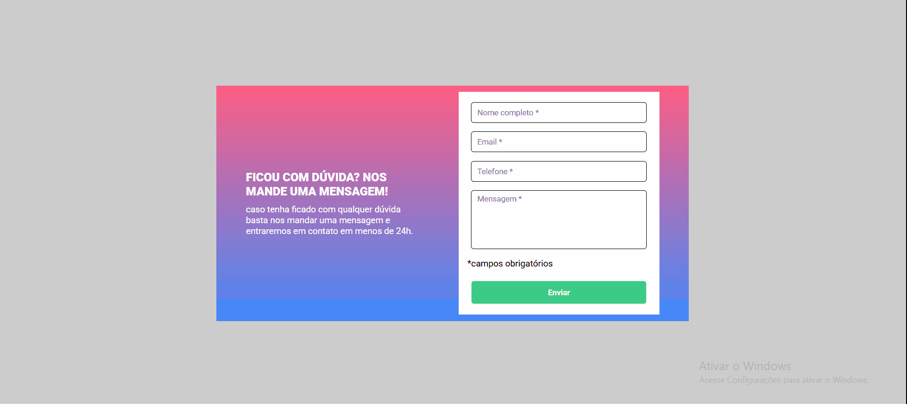

# 🧾 Formulário com validação

Um formulário com validação via JS.
Caso o usuário tente  enviar o formulário vazio ou até mesmo com espaços em branco será invalidado e aparecerá uma mensagem de "campo obrigatório" com uma borda vermelha no campo vazio e não será enviado, a validação ocorre em tempo real na medida em que o usuário for digitando uma borda verde de validação surgirá e validará o formulário.

## 💻 Design



## 🚀 Tecnologias utilizadas

- HTML
- CSS
- JavaScript

## 🔗 Clone o projeto

````
https://github.com/Ezequiel-Bomfim/formulario-com-validacao.git
````
````
git@github.com:Ezequiel-Bomfim/formulario-com-validacao.git
````

## 🗻 Desafios

Nesse projeto eu tive alguns desafios que foram superados mais uma vez.

- Um dos desafios e não menos importante foi criar a lógica JS.

- Validar os campos em tempo real.

- Fazer a mensagem aparecer junto da borda vermelha

- Invalidar os campos mesmo com espaços em brancos.

- Impedir o envio do formulário vazio.

## 🧑🏽‍💻Coisas que aprendi

Aqui eu irei citar alguns dos meus aprendizados.

- Validar formulário.

- Invalidar campos com espaços em branco.

- Impedir o envio do formulário vazio.

- Selecionar a mensagem de erro correspondente no campo.

## 🎯 Desenvolvimento contínuo

 Estou certo de que com cada passo meu eu evoluo um pouco mais, cada pequena vitória é um grande avanço na minha brilhante carreira.

 ## 🙏 Agradecimentos

Os meus agradecimentos vai para a equipe DevQuest por ter me apoiado e me ensinado tudo o que eu sei até este exato momento.